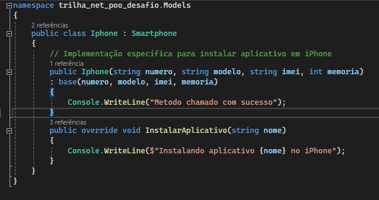

# DIO - Trilha .NET - Programação orientada a objetos
www.dio.me

## Desafio de projeto
Para este desafio, você precisará usar seus conhecimentos adquiridos no módulo de orientação a objetos, da trilha .NET da DIO.

## Solução 

Neste exemplo, a classe Smartphone contém propriedades compartilhadas e um método InstalarAplicativo, que deve ser implementado nas classes filhas:

As classes filhas Samsung e iPhone herda as propriedades da classe Smartphone e fornece sua própria implementação para o método InstalarAplicativo.

 

